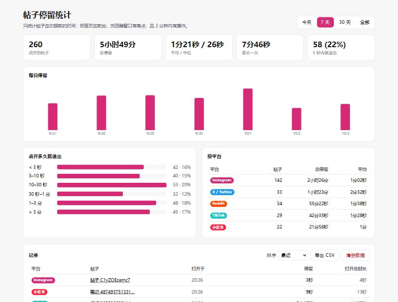
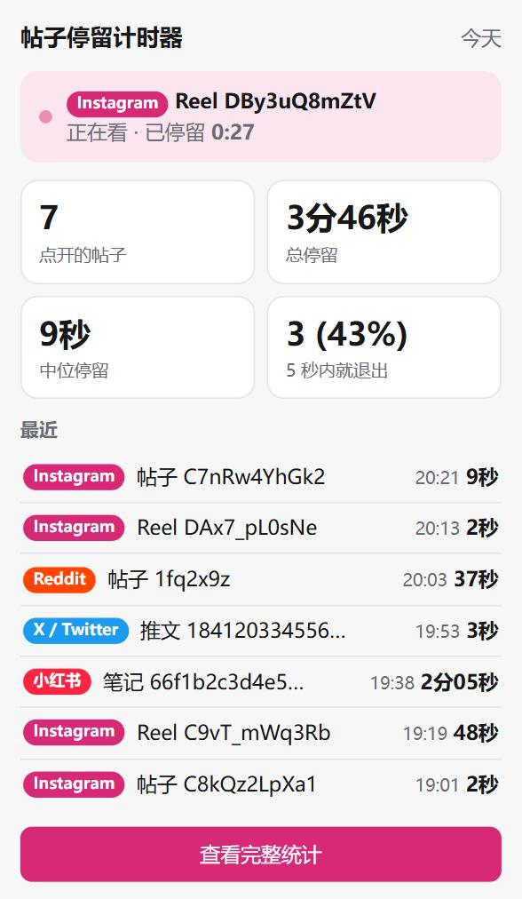

<div align="center">

# 帖子停留计时器 · Post Dwell Timer

**记录你在社交媒体上点开每个帖子后，到底停留了多久才退出。**

一个注重隐私的 Chrome / Edge 扩展（Manifest V3），支持 Instagram、X、Reddit、TikTok、小红书。

[English](README.md) · 简体中文

</div>

<p align="center">
  
</p>

## 为什么做这个

信息流是为"刷"设计的，人很难察觉自己的习惯：一天点开了多少帖子、多快就退出、哪些内容真正留住了你。这个扩展在你每次点开又离开一个帖子时记录一次会话，并汇总成直观的统计。所有数据只保存在本机。

## 功能

- **自动按帖子记录**：打开帖子 / Reel / 快拍 / 推文 / 视频 / 笔记即开始，离开、切换到别的帖子或关闭标签页即结束
- **区分"真正在看"**：每次会话记录两个时长：*停留*（帖子真正在你眼前的时间）和 *打开总时长*（从打开到离开的墙钟时间）
- **实时弹窗**：今日汇总、中位停留、"5 秒内就退出"比例，以及当前帖子的实时计时
- **统计面板**：今天 / 7 天 / 30 天 / 全部；每小时或每日柱状图、停留时长分布、按平台统计、可排序的记录表
- **导出 CSV**：Excel、Numbers、pandas 均可直接打开
- **隐私优先**：不注入内容脚本、不发网络请求、无埋点；数据存在 `chrome.storage.local`

<p align="center">
  
</p>

## 支持的平台

| 平台 | 识别的页面 |
|---|---|
| Instagram | `/p/{id}`、`/reel/{id}`、`/reels/{id}`、`/stories/{user}/{id}`、`/{user}/p/{id}` |
| X / Twitter | `/{user}/status/{id}`（含 `/photo/n`） |
| Reddit | `/r/{sub}/comments/{id}`（www 与 old） |
| TikTok | `/@{user}/video/{id}`、`/@{user}/photo/{id}` |
| 小红书 | `/explore/{id}`、`/discovery/item/{id}`、`/user/profile/{uid}/{id}` |

## 安装

尚未上架 Chrome 应用商店，需从源码加载：

1. 克隆仓库
   ```bash
   git clone https://github.com/MiaoWeiXu/Social-poster-timer.git
   ```
2. 打开 `chrome://extensions`（Edge：`edge://extensions`）
3. 打开右上角 **开发者模式**
4. 点 **加载已解压的扩展程序**，选择克隆下来的文件夹
5. 把扩展固定到工具栏，打开任意 Instagram 帖子，再点扩展图标查看

需要 Chrome / Edge 116 或更高版本。

## 计时规则

| 指标 | 定义 |
|---|---|
| **停留**（主指标） | 帖子所在标签页在前台、浏览器窗口有焦点，且 2 分钟内有键鼠操作 |
| **打开总时长** | 从打开帖子到离开的墙钟时间 |

- 同一帖子内的 URL 变化（轮播图 `?img_index=2`、`/photo/1`）**不会**拆成两次会话
- 停留不足 **1 秒** 的不记录：刷 Reels 时直接划走的、在后台打开但从未看过的
- 空闲阈值有意设为 2 分钟：看视频时不需要任何操作

## 架构

```
 浏览器事件                              纯逻辑（有单元测试）
 ─────────                              ──────────────────
 tabs.onUpdated / onRemoved             platforms.js  URL → { platform, postId } | null
 tabs.onActivated                       tracker.js    会话状态机
 windows.onFocusChanged         ──►                   (navigate / setAttended / finishAll)
 idle.onStateChanged                    stats.js      统计聚合与格式化
 alarms（30 秒心跳）
          │
          ▼
 background.js — 串行队列：读状态 → 归约 → 写状态 → 追加已完成会话
          │
          ▼
 chrome.storage.local { trackerState, sessions[] }
          │
          ├──► popup/       今日统计 + 实时计时
          └──► dashboard/   图表、分平台统计、记录表、CSV 导出
```

### 关键设计

- **不注入内容脚本**：这些网站都是单页应用，但 `history.pushState` 导航同样会触发 `chrome.tabs.onUpdated`，在 service worker 里监听 URL 就够了。不碰页面 DOM，网站改版不影响，权限也更少。
- **抗 service worker 挂起**：MV3 worker 随时可能被回收，所有状态持久化到 `chrome.storage.local`，时长完全由时间戳计算，不依赖内存计时器。
- **事件串行处理**：突发的标签页事件经由单一 Promise 队列处理，读-改-写不会交错。
- **崩溃恢复**：30 秒心跳刷新 `updatedAt`；浏览器异常退出后，下次启动时以最后一次心跳为结束时间收尾，最多丢失约 30 秒。
- **最小权限**：仅 `storage`、`idle`、`alarms` 及 5 个支持网站的 host 权限。**刻意不申请 `tabs`**，因此看不到其他任何网站的 URL；跳转到其他网站时 URL 不可见，恰好被视为"离开帖子"。

## 开发

无构建步骤、零依赖。修改后在 `chrome://extensions` 点扩展卡片上的刷新按钮即可。

```bash
npm test
```

测试基于 Node 内置的 `node:test`（Node 20+），覆盖 URL 匹配、会话状态机（焦点切换、后台标签页、快速划走、输入不可变）以及统计函数。

### 新增平台

1. 在 [`src/platforms.js`](src/platforms.js) 的 `PLATFORMS` 和 `RULES` 中各加一项
2. 在 [`manifest.json`](manifest.json) 的 `host_permissions` 中加入域名
3. 在 [`tests/platforms.test.js`](tests/platforms.test.js) 中补充用例

## 隐私

- 所有数据只保存在本地 `chrome.storage.local`，从不上传
- 只记录平台、帖子 ID、标准化的帖子链接和时间戳，不保存帖子内容、文案、浏览的用户名等页面信息
- 可在统计页点 **清空数据**，或直接移除扩展来删除全部数据

## 已知限制

- 仅限桌面浏览器，手机 App 中的使用无法统计
- 首页信息流里**没有点开**、直接刷过去的帖子不算（URL 没有变化）
- 平台若修改 URL 格式，需要更新 `src/platforms.js` 中的匹配规则

## 路线图

- [ ] 可选提醒：单个帖子停留超过 N 分钟时发通知
- [ ] 可配置空闲阈值与最短停留
- [ ] 按平台开关
- [ ] 上架 Chrome 应用商店

## 许可证

[MIT](LICENSE) © MiaoWeiXu
